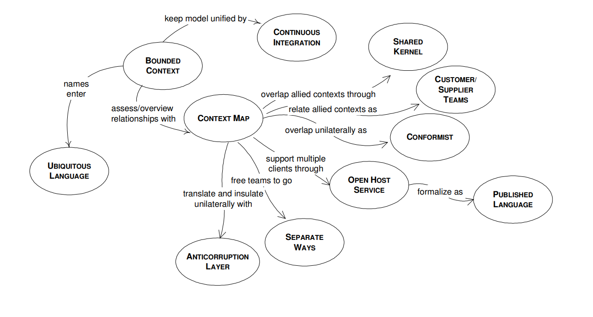

# Domain Driven Design (DDD)

We need to create an abstraction of the domain. We learn a lot about a domain while talking with the domain experts. But this raw knowledge is
not going to be easily transformed into software constructs, unless we build an abstraction of it, a blueprint in our minds.

What is this abstraction? It is a model, a model
of the domain. According to Eric Evans, a domain model is not a
particular diagram; it is the idea that the diagram is intended to
convey. It is not just the knowledge in a domain expert's head; it
is a rigorously organized and selective abstraction of that
knowledge. A diagram can represent and communicate a model,
as can carefully written code, as can an English sentence.

A domain contains just too much
information to include it all into the model. And much of it is not
even necessary to be considered. This is a challenge by itself.
What to keep and what to throw away? It's part of the design,
the software creation process.

We are not alone in
this process, so we need to share knowledge and information,
and we need to do it well, precisely, completely, and without
ambiguity. we need to communicate
the model.

When we have a model expressed, we can start doing code
design. This is different from software design. Software design
is like creating the architecture of a house, it's about the big
picture. On the other hand, code design is working on the details,
like the location of a painting on a certain wall.

Nonetheless the final product won't be good
without good code design. Here code design patterns come
handy, and they should be applied when necessary.

## There are different approaches to software design

### One is the waterfall design method

The business experts put up a set of requirements which
are communicated to the business analysts. The analysts create a
model based on those requirements, and pass the results to the
developers, who start coding based on what they have received.
It's a one way flow of knowledge.

### Another approach is the Agile methodologies, such as Extreme Programming (XP)

These methodologies are a collective
movement against the waterfall approach, resulting from the
difficulties of trying to come up with all the requirements
upfront.

The Agile methods have their own problems and limitations;
they advocate simplicity, but everybody has their own view of
what that means. Also, continuous refactoring done by
developers without solid design principles will produce code that
is hard to understand or change. And while the waterfall
approach may lead to over-engineering, the fear of overengineering may lead to another fear: the fear of doing a deep,
thoroughly thought out design.

# I. Building Domain Knowledge

In order to be able to build up a model you need to
extract essential information and generalize it.

Domain experts know their area of expertise well, but they organize and use their
knowledge in a specific way, which is not always the best to be
implemented into a software system. The analytical mind of the
software designer helps unearth some of the key concepts of the domain during discussions.

# II. The Ubiquitous Language

it is absolutely necessary
to develop a model of the domain by having the the software
specialists work with the domain experts; however, that
approach usually has some initial difficulties due to a
fundamental communication barrier.

The terminology of day-to-day discussions is disconnected from
the terminology embedded in the code (ultimately the most
important product of a software project).

We tend to use our own dialects during these design sessions,
but none of these dialects can be a common language because
none serves everyone's needs.

> **A core principle of domain-driven design is to use a language
based on the model.**

Use the model as the backbone of a language. Request that the
team use the language consistently in all communications, and
also in the code.

Domain experts should object to terms or structures that are
awkward or inadequate to convey domain understanding. If
domain experts cannot understand something in the model or the
language, then it is most likely that there is something is wrong
with it. On the other hand, developers should watch for
ambiguity or inconsistency that will tend to appear in design.

## Creating the Ubiquitous Language

UML cannot convey
two important aspects of a model: the meaning of the concepts it
represents and what the objects are supposed to do. But that is
OK, since we can add other communication tools to do it.

We can use documents. One advisable way of communicating
the model is to make some small diagrams each containing a
subset of the model. These diagrams would contain several
classes, and the relationship between them. That already
includes a good portion of the concepts involved. Then we can
add text to the diagram. The text will explain behavior and
constraints which the diagram cannot.

Those documents can be even hand-drawn, because that
transmits the feeling that they are temporary, and might be
changed in the near future, which is true, because the model is
changed many times in the beginning before it reaches a more
stable status.

> **It might be tempting to try to create one large diagram over the
entire model. But it will be so cluttered
that it will not convey the understanding better then did the
collection of small diagrams.**
---
> *Creating multiple small models/diagrams, then organize them into a larger unified model when your understanding has been sufficient built-up*
---

## how do we approach the transition from model to code?

> **One of the recommended design techniques is the so called
analysis model.**

which is seen as separate from code design and
is usually done by different people. The analysis model is the
result of business domain analysis, resulting in a model which
has no consideration for the software used for implementation.
Such a model is used to understand the domain.

> **Object-oriented programming is another good technique.**

Object-oriented programming is suitable for model
implementation because they are both based on the same
paradigm. Object-oriented programming provides classes of
objects and associations of classes, object instances, and
messaging between them. OOP languages make it possible to
create direct mappings between model objects with their
relationships, and their programming counterparts.

> **Procedural programming languages (C, Cobol) is not recommended for model-driven design.**

A program written in a procedural language is usually perceived as a set of
functions, one calling another, and working together to achieve a
certain result. Such a program cannot easily encapsulate
conceptual connections, making mapping between domain and
code difficult to be realized.

# III. The Building Blocks Of A Model-Driven Design

## Layered Architecture

when domain-related code is mixed with the other
layers, it becomes extremely difficult to see and think about.
Superficial changes to the UI can actually change business logic.
To change a business rule may require meticulous tracing of UI
code, database code, or other program elements. Implementing
coherent, model-driven objects becomes impractical. Automated
testing is awkward.

> **Therefore, partition a complex program into LAYERS. Develop
a design within each LAYER that is cohesive and that depends
only on the layers below. Follow standard architectural patterns
to provide loose coupling to the layers above.**

*Concentrate all the code related to the domain model in one layer and isolate it from the user interface, application, and infrastructure code.*

**A common architectural solution for domain-driven designs contain four conceptual layers:**

1. **User Interface** (Presentation Layer): Responsible for presenting information to the user and interpreting user commands.
2. **Application** Layer: This is a thin layer which coordinates the application activity. It does not contain business logic. It does not hold the state of the business objects, but it can hold the state of an application task progress.
3. **Domain** Layer: This layer contains information about the domain. This is the heart of the business software. The state of business objects is held here.
4. **Infrastructure** Layer: This layer acts as a supporting library for all the other layers. It provides communication between layers, implements persistence for business objects, contains supporting libraries for the user interface layer, etc.

It is important to divide an application in separate layers, and
establish rules of interactions between the layers. If the code is
not clearly separated into layers, it will soon become so
entangled that it becomes very difficult to manage changes.

For example, a typical interaction of the application, domain and
infrastructure could look like this. The user wants to book a
flights route, and asks an application service in the application
layer to do so. The application tier fetches the relevant domain
objects from the infrastructure and invokes relevant methods on
them, e.g., to check security margins to other already booked
flights. Once the domain objects have made all checks and
updated their status to “decided”, the application service persists
the objects to the infrastructure.

## 1. Entities

There is a category of objects which seem to have an identity,
which remains the same throughout the states of the software.
For these objects it is not the attributes which matter, but a
thread of continuity and identity, which spans the life of a
system and can extend beyond it. Such objects are called Entities

Implementing entities in software means creating
identity.

Define a means of distinguishing each object
regardless of its form or history. Be alert to requirements that
call for matching objects by attributes. Define an operation that
is guaranteed to produce a unique result for each object, possibly
by attaching a symbol that is guaranteed unique. This means of
identification may come from the outside, or it may be an
arbitrary identifier created by and for the system, but it must
correspond to the identity distinctions in the model. The model
must define what it means to be the same thing.

Entities are important objects of a domain model, and they
should be considered from the beginning of the modeling
process. It is also important to determine if an object needs to be
an entity or not.

## 2. Value Objects

It takes a lot of careful
thinking to decide what makes an identity, because a wrong
decision would lead to objects with the same identity, something
that is not desired.

There are also performance implications in
making all objects entities. There has to be one instance for each
object. If Customer is an entity object, then one instance of this
object, representing a specific bank client, cannot be reused for
account operations corresponding to other clients. The outcome
is that such an instance has to be created for every client. This
can result in system performance degradation when dealing with
thousands of instances.

There are cases when we need to contain some attributes of a
domain element. We are not interested in which object it is, but
what attributes it has. An object that is used to describe certain
aspects of a domain, and which does not have identity, is named
Value Object.

> **It is not helpful to make all object entities for the sake
of uniformity. Actually, it is recommended to select as entities
only those objects which conform to the entity definition. And
make the rest of the objects Value Objects.**

It is highly recommended that value objects be immutable. They
are created with a constructor, and never modified during their
life time. **Being immutable, and having no identity, Value
Objects can be shared.**

Value Objects can contain other Value Objects, and they can
even contain references to Entities.

## 3. Services

When we analyze the domain and try to define the main objects
that make up the model, we discover that some aspects of the
domain are not easily mapped to objects. Objects are generally
considered as having attributes, an internal state which is
managed by the object, and exhibit a behavior.

But there are some actions in the domain, some
verbs, which do not seem to belong to any object. *For example, to transfer
money from one account to another; should that function be in
the sending account or the receiving account?*

When such a behavior is recognized in the domain, the best
practice is to declare it as a Service. Such an object does not
have an internal state, and its purpose is to simply provide
functionality for the domain.

A service is not about the object performing
the service, but is related to the objects the operations are
performed on/for. In this manner, a Service usually becomes a
point of connection for many objects. This is one of the reasons
why behavior which naturally belongs to a Service should not be
included into domain objects. If such functionality is included in
domain objects, a dense network of associations is created
between them and the objects which are the beneficiary of the
operations. A high degree of coupling between many objects is a
sign of poor design because it makes the code difficult to read
and understand, and more importantly, it makes it difficult to
change.

**There are three characteristics of a Service:**

1. The operation performed by the Service refers to a domain
concept which does not naturally belong to an Entity or Value
Object.
2. The operation performed refers to other objects in the domain.
3. The operation is stateless.

When a significant process or transformation in the domain is
not a natural responsibility of an Entity or Value Object, add an
operation to the model as a standalone interface declared as a
Service.

While using Services, is important to keep the domain layer
isolated. It is easy to get confused between services which
belong to the domain layer, and those belonging to the
infrastructure and application layer.

## 4. Modules

For a large and complex application, the model tends to grow
bigger and bigger. The model reaches a point where it is hard to
talk about as a whole, and understanding the relationships and
interactions between different parts becomes difficult. For that
reason, it is necessary to organize the model into modules.
Modules are used as a method of organizing related concepts
and tasks in order to reduce complexity.

Modules are widely used in most projects. It is easier to get the
picture of a large model if you look at the modules it contains,
then at the relationships between those modules. After the
interaction between modules is understood, one can start
figuring out the details inside of a module. It's a simple and
efficient way to manage complexity.

+ Communicational cohesion is achieved
when parts of the module operate on the same data

+ The functional cohesion is achieved when all
parts of the module work together to perform a well-defined
task. This is considered the best type of cohesion.

After the role of the
module is decided, it usually stays unchanged, while the
internals of the module may change a lot. It is recommended to
have some flexibility, and allow the modules to evolve with the
project, and should not be kept frozen. It is true that module
refactoring may be more expensive than a class refactoring, but
when a module design mistake is found, it is better to address it
by changing the module then by finding ways around it.

## 5. Aggregates

Domain objects go through a set of states during their
life time. They are created, placed in memory and used in
computations, and they are destroyed. In some cases they are
saved in permanent locations, like a database, where they can be
retrieved from some time later, or they can be archived. At some
point they can be completely erased from the system, including
database and the archive storage.

Managing the life cycle of a domain object constitutes a
challenge in itself, and if it is not done properly, it may have a
negative impact on the domain model.

*Aggregate is a domain
pattern used to define object ownership and boundaries.
Factories and Repositories are two design patterns which help us
deal with object creation and storage.*
---

For every traversable association in the model,
there has to be corresponding software mechanism which
enforces it. Real associations between domain object end up in
the code, and many times even in the database. 

A one-to-one relationship between a customer and the bank account opened on
his name is expressed as a reference between two objects, and
implies a relationship between two database tables, the one
which keeps the customers and the one which keeps the
accounts.

A one-to-many association is more complex because it involves
many objects which become related. This relationship can be
simplified by transforming it into an association between one
object and a collection of other objects, although it is not always
possible.

There are many-to-many associations and a large number of
them are bidirectional. This increases complexity a lot, making
the life cycle management of such objects quite difficult.

+ Firstly, associations which are not essential for the model should
be removed. They may exist in the domain, but they are not
necessary in our model, so take them out.

+ Secondly, multiplicity can be reduced by adding a constraint. If many objects satisfy a
relationship, it is possible that only one will do it if the right
constraint is imposed on the relationship.

+ Thirdly, many times bidirectional associations can be transformed in unidirectional
ones. Each car has an engine, and every engine has a car where it
runs. The relationship is bidirectional, but it can be easily
simplified considering that the car has an engine, and not the
other way around.

When the system archives or
completely deletes information about a customer, it has to make
sure that all the references are removed. If many objects hold
such references, it is difficult to ensure that they are all removed.
Also, when some data changes for a customer, the system has to
make sure that it is properly updated throughout the system, and
data integrity is guaranteed. This is usually left to be addressed
at database level. Transactions are used to enforce data integrity.

But if the model was not carefully designed, there will be a high
degree of database contention, resulting in poor performance.
While database transactions play a vital role in such operations,
it is desirable to solve some of the problems related to data
integrity directly in the model.

It is also necessary to be able to enforce the invariants. The
invariants are those rules which have to be maintained whenever
data changes. This is difficult to realize when many objects hold
references to changing data objects.

It is difficult to guarantee the consistency of changes to objects
in a model with complex associations. Many times invariants
apply to closely related objects, not just discrete ones. Yet
cautious locking schemes cause multiple users to interfere
pointlessly with each other and make a system unusable.

> **An Aggregate is a group of
associated objects which are considered as one unit with regard
to data changes.**

The Aggregate is demarcated by a boundary
which separates the objects inside from those outside. Each
Aggregate has one root. The root is an Entity, and it is the only
object accessible from outside. The root can hold references to
any of the aggregate objects, and the other objects can hold
references to each other, but an outside object can hold
references only to the root object. If there are other Entities
inside the boundary, the identity of those entities is local,
making sense only inside the aggregate.

## 6. Factories

Entities and Aggregates can often be large and complex - too
complex to create in the constructor of the root entity. Infact
trying to construct a complex aggregate in its constructure is in
contradiction with what often happens in the domain itself,
where things are created by other things (like electronics get
created in on assembly lines). It is like having the printer build
itself.

Creation of an object can be a major operation in itself, but
complex assembly operations do not fit the responsibility of the
created objects. Combining such responsibilities can produce
ungainly designs that are hard to understand.

*Factories are used to encapsulate the
knowledge necessary for object creation, and they are especially
useful to create Aggregates. When the root of the Aggregate is
created, all the objects contained by the Aggregate are created
along with it, and all the invariants are enforced.*
---

It is important for the creation process to be atomic. If it is not,
there is a chance for the creation process to be half done for
some objects, leaving them in an undefined state. This is even
more true for Aggregates.

*We won't try to present the patterns
from a design perspective, but from a domain modeling one.*

When creating a Factory, we are forced to violate an object's
encapsulation, which must be done carefully. Whenever
something changes in the object that has an impact on
construction rules or on some of the invariants, we need to make
sure the Factory is updated to support the new condition.

Entity Factories and Value Object Factories are different. Values
are usually immutable objects, and all the necessary attributes
need to be produced at the time of creation. When the object is
created, it has to be valid and final.

**There are times when a Factory is not needed, and a simple
constructor is enough. Use a constructor when:**

1. The construction is not complicated.
2. The creation of an object does not involve the
creation of others, and all the attributes needed are
passed via the constructor.
1. The client is interested in the implementation,
perhaps wants to choose the Strategy used.
1. The class is the type. There is no hierarchy involved,
so no need to choose between a list of concrete
implementations.

Another observation is that Factories need to create new objects
from scratch, or they are required to reconstitute objects which
previously existed, but have been probably persisted to a
database.

> **Bringing Entities back into memory from their resting
place in a database involves a completely different process than
creating a new one.**

One obvious difference is that the new
object does not need a new identity.

## 7. Repositories

In a model-driven design, objects have a life cycle starting with
creation and ending with deletion or archiving. A constructor or
a Factory takes care of object creation.

In an object-oriented language,
one must hold a reference to an object in order to be able to use
it. To have such a reference, the client must either create the
object or obtain it from another, by traversing an existing
association.

Using such a rule in the design
will force the objects to hold on a series of references they
probably wouldn't keep otherwise. This increases coupling,
creating a series of associations which are not really needed.

One way to solve this is fetch the references from database.

When a client wants to use an object, it accesses the database,
retrieves the object from it and uses it. This seems like a quick
and simple solution, but it has negative impacts on the design.

> **A poor solution is for
the client to be aware of the details needed to access a database.
For example, the client has to create SQL queries to retrieve the
desired data.**

What happens if a decision is made to change the
underlying database? All that scattered code needs to be changed
to be able to access the new storage. When client code accesses a
database directly, it is possible that it will restore an object
internal to an Aggregate. This breaks the encapsulation of the
Aggregate with unknown consequences.

*Therefore, use a Repository, the purpose of which is to
encapsulate all the logic needed to obtain object references. The
domain objects won't have to deal with the infrastructure to get
the needed references to other objects of the domain. They will
just get them from the Repository and the model is regaining its
clarity and focus.*
---

The Repository may store references to some of the objects.
When an object is created, it may be saved in the Repository,
and retrieved from there to be used later. If the client requested
an object from the Repository, and the Repository does not have
it, it may get it from the storage. Either way, the Repository acts
as a storage place for globally accessible objects.

The Repository may also include a Strategy. It may access one
persistence storage or another based on the specified Strategy. It may use different storage locations for different type of objects.

There is a relationship between Factory and Repository. They
are both patterns of the model-driven design, and they both help
us to manage the life cycle of domain objects. While the Factory
is concerned with the creation of objects, the Repository takes
care of already existing objects. The Repository may cache
objects locally.

Objects are either created using a constructor
or they are passed to a Factory to be constructed. For this reason,
the Repository may be seen as a Factory, because it creates objects.

> **The Factory should create new objects, while the
Repository should find already created objects.**

# IV. Continuous Refactoring

*Refactoring is the process of redesigning the code
to make it better without changing application behavior.*
---

Refactoring is usually done in small, controllable steps, with
great care so we don't break functionality or introduce some
bugs.

Automated tests are of great help to ensure that
we haven't broken anything.

There are many ways to do code refactoring. There are even
refactoring patterns. Such patterns represent an automated
approach to refactoring.

Technical refactoring, the one based on patterns, can be
organized and structured.

One of the first things we are taught about modeling is to read
the business specifications and look for nouns and verbs. The
nouns are converted to classes, while the verbs become methods.
This is a simplification, and will lead to a shallow model. All
models are lacking depth in the beginning, but we should
refactor the model toward deeper and deeper insight.

# V. Preserving Model Integrity

A unified enterprise model is an ideal which is not easily
accomplished, and sometimes it is not even worth trying it. Such
projects need the combined effort of many teams. The teams
need a large degree of independence in the development process,
because they do not have the time to constantly meet and discuss
the design. The coordination of such teams is a daunting task.
They might belong to different departments and have separate
management. When the design of the model evolves partially
independently, we are facing the possibility to lose model
integrity. Preserving the model integrity by striving to maintain
one large unified model for the entire enterprise project is not
going to work.

Instead of trying to keep
one big model that will fall apart later, we should consciously
divide it into several models. Several models well integrated can
evolve independently as long as they obey the contract they are
bound to. Each model should have a clearly delimited border,
and the relationships between models should be defined with
precision.

## Bounded Context

There is no formula to divide one large model into smaller ones.
Try to put in a model those elements which are related, and
which form a natural concept. A model should be small enough
to be assigned to one team.

Explicitly set boundaries in terms of team
organization, usage within specific parts of the application, and
physical manifestations such as code bases and database
schemas. Keep the model strictly consistent within these bounds,
but don't be distracted or confused by issues outside.

A Bounded Context is not a Module. A Bounded Context
provides the logical frame inside of which the model evolves.
Modules are used to organize the elements of a model, so
Bounded Context encompasses the Module.

However, breaking down the system into ever-smaller contexts
eventually loses a valuable level of integration and coherency.

## Anticorruption Layer
