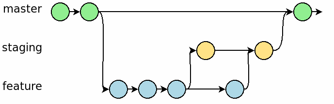
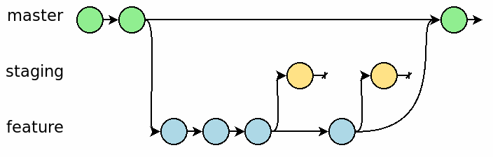

# How to switch from GitFlow to Trunk-Based Development

You've decided GitFlow is totally uncool. But what if you're already using it? How can you break the habit?

I have long been an advocate against GitFlow. And I’m not at all the only one.

But what if you’re already using it. How can you break the habit, and switch to the much easier to use trunk-based development?

**I’m glad you asked!**

1. If you don’t already have, configure unit tests and any other automated validation (linters, formatters, security scanners) to run for every pull request.
2. Stop using the develop branch. Like immediately. Delete it if you can. Archive it if you’re afraid there’s unmerged work of value there—prevent future pushes to develop in GitHub/GitLab/whatever by protecting the branch.
3. All new feature branches must come directly off of main (or master or trunk, or whatever yours is called).
4. Open staging to allow pushes from anyone on the team.

That’s really it from a setup perspective. The key is to recognize that main is now the only long-lived branch. And all other short-lived branches branch off of, and merge back into main.

Perhaps the least obvious change here is what’s happening to staging, so let me talk about that in a bit more detail.

In traditional GitFlow, staging usually works something like this:

Work flows from a feature branch, to staging, then after validation, finally to main.

The approach I advocate looks only slightly different on paper, but the implications are significant.

Work is still done in a feature branch, and it still flows to staging for validation, but the staging environment is considered ephemeral. There’s nothing “special” about it, as far as the workflow is concerned. It’s only a sandbox. Every push to staging is eventually thrown away.

Finally, once all validation is complete, the pull request for the feature can be merged into master, and continuous deployment can be kicked off.

This subtle change might seem trivial at first blush, but it offers a number of advantages:

- It demotes the staging environment from having a special place in your deployment pipeline, possibly with gatekeeper scripts and/or procedures before and after it, to being just a tool to get a job (validation) done. It no longer holds any “official” role in the pipeline.
- It eliminates the burden of resolving merge conflicts. It’s not special, so it doesn’t matter if Bob’s in-progress feature merges cleanly with Alice’s at this stage. Just force push to staging any time you want to (well, as long as nobody else is actively using that branch).
- And as a bonus, it makes your git history a lot easier to read.

Switching away from GitFlow is just one of the steps toward better software delivery with continuous deployment.